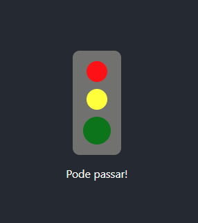

# Desafio de acriação de um semaforo do curso React JS - Dominando o Frontend

<p align="center">
  
</p>

## Tecnologias:

- Typescript
- ReactJS

## Lógica de resolução

A resolução que eu propus para o desafio envolve uma lógica com vetores, onde eu utilizo um vetor de tamanho 3 { 0, 1, 2 }, onde cada posição é uma cor do semafoto

```
0 - vermelho
1 - amarelo
2 - verde
```

Com isso, cada posição do array é um `boolean`, onde a posição que estiver com `true` é aumentado o tamanho do componente e uma mensagem na parte inferior é mostrada
